.. _42qu_newbie:

42qu.com 入门指南 : 程序员 篇  
==============================================

:作者: 张沈鹏 `zuroc.42qu.com <http://zuroc.42qu.com>`_  

前言
~~~~~~~~~~~~~~~~~~~~~~~~~~~~~~~~~~~~~~~~~~~~~~
42qu.com是一个开源项目 , 开源的初衷如下 :

    看了 `吉米·威尔士关于维基百科诞生的演讲 <http://v.youku.com/v_show/id_XMjIxODYzNDA4.html>`_

    再一次被开源的力量所震撼 ,我觉得, 我应该也去搞一个NB的开源项目

    因为发现很多初学者用python写网站没经验, 写出来的网站比较卡, 让我很痛心,于是这一次, 我又开始了一个坑 ,打算基于Python的Tornado, 打造一套可以抗千万PV的SNS/微博/轻博客的开源基础框架
    
    让以后Python程序员写SNS, 省去很重复开发的工作 - 比如登录, 比如头像, 比如相册, 比如日记, 比如等等等... 

对了 , 你也许会对下面这个感兴趣 - :ref:`42qu.com 开源项目 代码贡献者 奖励方案 <reward_42qu>` 

欢迎参与, 前端, 美工, 程序员, 都可以! 
 

申请开发权限
~~~~~~~~~~~~~~~~~~~~~~~~~~~~~~~~~~~~~~~~~~~~~~

我们提供了一个能很方便运行42qu.com代码的线上开发服务器

因为资源极度有限 , 此开发服务器仅对有能力贡献代码的开发者开放

首先, 在 bitbucket 上提交 issue  

https://bitbucket.org/zuroc/zpage/issues/new

向管理员申请开发服务器的访问权限 

申请中请注明 

    #. 在42qu.com的主页地址

    #. 期望认领的任务 

        * 方式 1 :  
            
            从 `42qu.tk <http://42qu.tk/project-groupTask-1-assignedTo.html>`_ 认领未分配的任务 (请附上任务编号) 
          
            在任务被认领后, 我们将会给出更详尽的需求文档 :)

        * 方式 2 : 
            
            如果你有自己想在42qu.com上实现的功能 

            可以在bitbucket的issue中做详细说明 

管理员确认后 , 你会收到一份邮件

邮件里面会给出你所分配到的开发域名

注册开发域名
~~~~~~~~~~~~~~~~~~~~~~~~~~~~~~~~~~~~~~~~~~~~~~

去 https://www.dnspod.cn/ 注册一个帐号 , 绑定邮件里面提到的域名

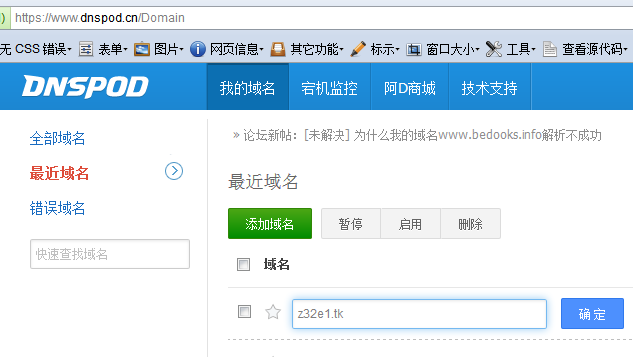

然后去 http://dot.tk/ 注册一个免费的顶级域名 (请先创建帐号, 然后注册)

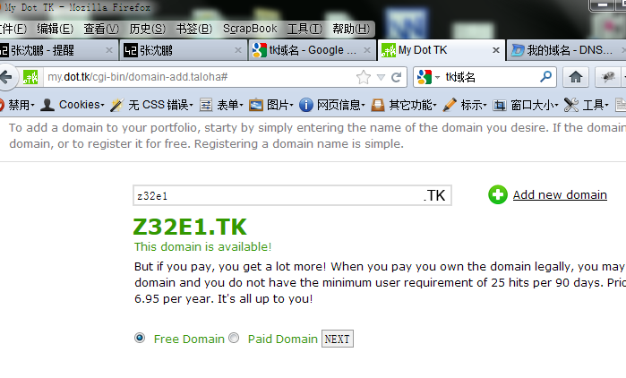

选择用自己的DNS服务器

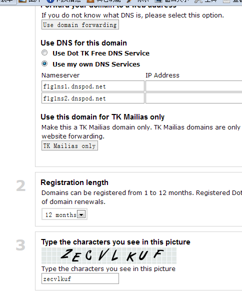

把 dnspod 的 namesever 地址copy过来

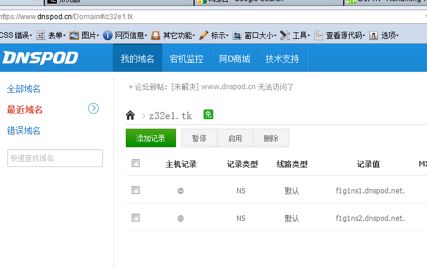

最后在 dnspod 上 , 追加两个域名解析, 一个什么也不需要填 , 一个填写* , 都指向开发服务器的IP

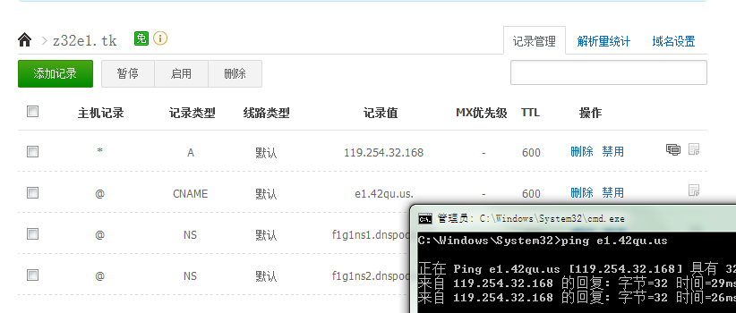

在域名生效前 , dnspod 会提示 "检测到域名没有填写DNS" 的错误 , 不要管它

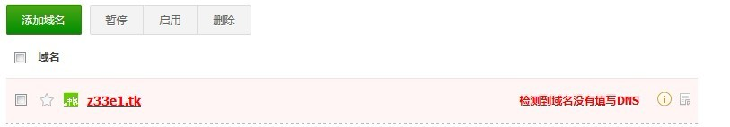

我们接着走下面的流程 , 域名生效要等上好几个小时 ...

人生充满了等待  ...

如果你的域名不幸被抢注了 , 那就随便注册一个吧 , 下文如何使用自定义域名的方法

登录服务器 
~~~~~~~~~~~~~~~~~~~~~~~~~~~~~~~~~~~~~~~~~~~~~~

参阅  :ref:`SSH 登录 Linux服务器 流程说明 <ssh_login>`  , 强烈向windows用户推荐文中提到 xshell ssh客户端

注意 : 

    #. ssh key 已经生成 , ssh-keygen 生成密钥 命令这一句可以跳过
    #. virtualenv 也已经安装 

登录后请 执行 passwd 命令 , 修改密码

Fork zpage 项目 到自己的帐号 
~~~~~~~~~~~~~~~~~~~~~~~~~~~~~~~~~~~~~~~~~~~~~~

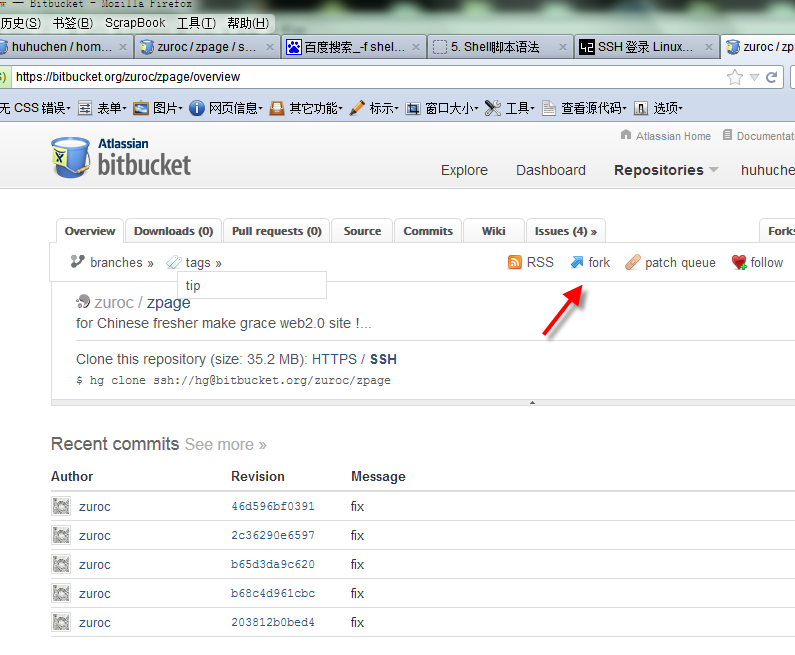

`项目主页 <https://bitbucket.org/zuroc/zpage/src>`_  

注意 :

    #. fork的那个板块可能被折叠,  导致你看不见fork的链接 , 点击就可以把它展开

    #. 如果bitbucket提示出错, 不管它

添加自己的密钥到bitbucket  
~~~~~~~~~~~~~~~~~~~~~~~~~~~~~~~~~~~~~~~~~~~~~~
 
ssh中 ::

    cat ~/.ssh/id_rsa.pub

然后 , 复制粘贴 ( https://bitbucket.org/account/ssh-keys/ )

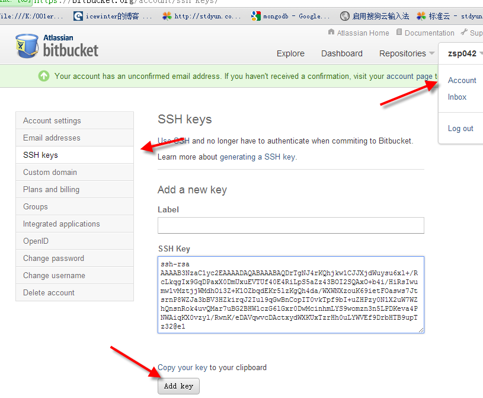

    
克隆代码库
~~~~~~~~~~~~~~~~~~~~~~~~~~~~~~~~~~~~~~~~~~~~~~~~~~~~~~~~~ 
   
访问 https://bitbucket.org/repo/mine , 点击进入自己的项目

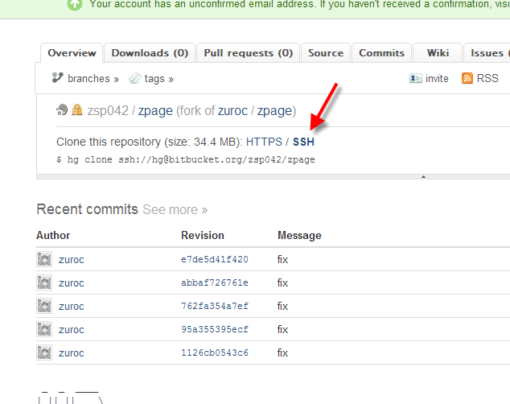

注意 , 不要用privite的项目 , 不然将来没法给官方项目提交自己的修改   

找到自己fork的项目ssh的地址 ( 注意不是https的地址 ) , 然后clone

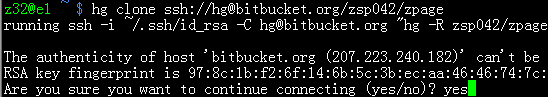

请clone到自己home目录下的 zpage 文件夹 (不然会找不到静态文件)

人生充满了等待  ...

加入42qu的官方项目到 hgrc
~~~~~~~~~~~~~~~~~~~~~~~~~~~~~~~~~~~~~~~~~~~~~~~~~~~~~~~~~ 

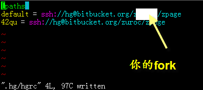

在 ~/zpage/.hg/hgrc 中加入 ::

    42qu = ssh://hg@bitbucket.org/zuroc/zpage

以后就可以通过 ::

    hg fetch 42qu

来同步官方代码到自己的fork

配置SMTP邮件服务器
~~~~~~~~~~~~~~~~~~~~~~~~~~~~~~~~~~~~~~~~~~~~~~~~~~~~~~~~~ 
到 `mailgun.net <http://mailgun.net/>`_ 注册一个免费的帐号   

    .. image::  _image/newbie/mailgun.png

    找到用户名密码

    .. image::  _image/newbie/smtp.png

    编辑自己的配置文件 ::
 
        vi ~/zpage/config/user/$USER.py

    修改为刚刚注册的SMTP服务器

    .. image::  _image/newbie/smtp_config.png

注意 , 因为用户名和密码都写到了配置文件里面 , 而这些是会在开源代码库中公开 , 所以请不要用私人邮箱的SMTP

小贴士 :

    Mailgun 是由美国著名的投资者/机构 Y Combinator, SV Angel, Yuri Milner, Maynard Webb, Paul Buchheit (Gmail 创始人之一), Geoff Ralson (Yahoo Mail 创始人) 等投资的一家新兴邮件发送服务提供商。

数据库
~~~~~~~~~~~~~~~~~~~~~~~~~~~~~~~~~~~~~~~~~~~~~~~~~~~~~~~~~ 

管理的地址 http://e1sql.42qu.us/ , 用户名密码见邮件

注意  : zpage 和 zpage_google 的共用的开发数据库 , 请不要乱动 

你可以创建名为 zpage_自己在42qu的个性网址/ID 数据库

启动服务器
~~~~~~~~~~~~~~~~~~~~~~~~~~~~~~~~~~~~~~~~~~~~~~~~~~~~~~~~~ 

先压缩一下静态文件 ::

    python ~/zpage/static/make.py 

然后 ping 一下开发测试的域名 , 看看ip是否已经指向了ssh服务器的IP 

如果没有生效 , 你可以去看场电影

如果成功 , 就可以启动服务器了 ::

    cd ~/zpage
    ./server_ctrl_dev.py 

图片都是挂掉的 , 不管它

要关闭服务 , 请连续按两次 Ctrl + C 

登录自己的42区
~~~~~~~~~~~~~~~~~~~~~~~~~~~~~~~~~~~~~~~~~~~~~~~~~~~~~~~~~ 

为了保护网站用户的隐私 , 开发服务器的数据库对涉及个人隐私的数据都做了替换处理

不过你还是可以用自己帐号登录

首先, 我们要找到自己的邮箱对应的id , 比如访问 ::

    http://api.42qu.com/user/info/mail/id?mail=zsp007@gmail.com 

其中zsp007@gmail.com为你在42qu.com的注册邮箱

可以看到返回 1 , 那么我们就可以用 1@42qu.com 登录在42qu.com上对应的帐号 (密码不变)

如果登录时提示帐号不存在 , 那就重新注册吧

向官方代码库提交自己的改动
~~~~~~~~~~~~~~~~~~~~~~~~~~~~~~~~~~~~~~~~~~~~~~~~~~~~~~~~~ 
首先 fetch 线上的代码::

    hg fetch 42qu

然后合并完成代码后 , 可以向42qu.com的官方代码库发起pull请求

还是访问 https://bitbucket.org/repo/mine , 点击进入自己的项目

然后, 如图

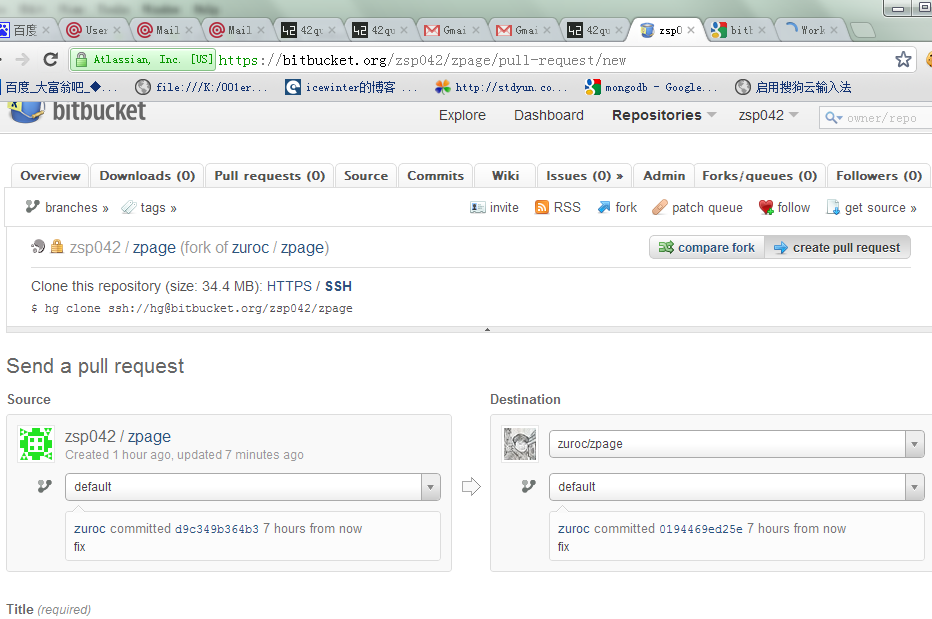

.. _domain_is_reged:

域名被抢注了怎么办
~~~~~~~~~~~~~~~~~~~~~~~~~~~~~~~~~~~~~~~~~~~~~~~~~~~~~~~~~ 

cd ~/zpage; rm static/.js_hash static/.css_hash ; python static/make.py

然后安装上文的流程, 向官方代码库提交自己的改动 ; 请只包含配置文件的修改 ;

标题为 : 自定义使用域名 

遇到问题怎么办 ?
~~~~~~~~~~~~~~~~~~~~~~~~~~~~~~~~~~~~~~~~~~~~~~

穿越火线后 , 加入 

https://groups.google.com/group/42qu-school

这个邮件列表  , 然后提问

推荐用Gmail邮箱订阅

提问前 , 请仔细阅读 `提问的智慧 <http://www.beiww.com/doc/oss/smart-questions.html#intro>`_

管理员备忘  
~~~~~~~~~~~~~~~~~~~~~~~~~~~~~~~~~~~~~~~~~~~~~~

#. 开通开发人员的帐号

    #. 登录主机 e1 @ e1.42qu.us ::

        cd ~/zpage/misc/vps $ 
        vi vps_new.py  #设置需要开通哪些帐号 
        ./vsp_new.sh

