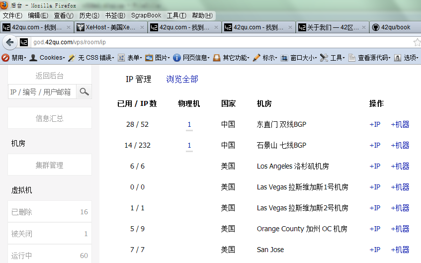
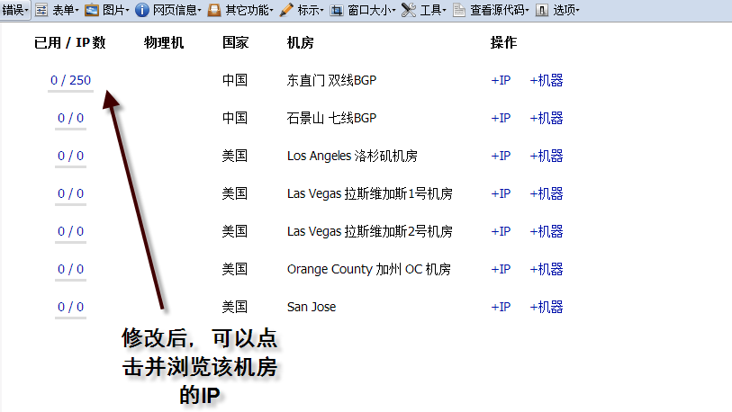

后台 : VPS 管理页面 可以按 机房 浏览 IP
==================================================================

作者 : `张沈鹏 <http://zuroc.42qu.com>`_ 

网址 : http://god.42qu.com/vps/room/ip

分支 : zuroc_20120518_vps_ip

代码 : 

    z32@e1 ~/zpage $ hg bdiff zuroc_20120518_vps_ip | pastebin

    http://dpaste.de/Ya2hy/raw/

备注 :

       线上后台有密码

       请用自己的开发服务器的看
        
       work@potato ~/zpage $ ./restart.god 

       同时请修改 ~/zpage/config/default.py 中的 o.PRIVILEGE_SUPER

       加入自己的在开发服务器上的数字ID , 以获取管理员的权限 

页面 :

