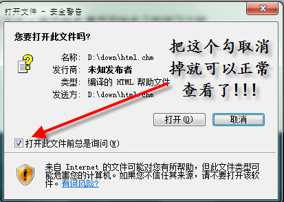

.. _readme:

使用须知 :role:`readme`
=======================

常见问题
-----------------------------

Windows用户, 如果你下载的参考文献中 .chm 文件无法浏览 , 按下面的步骤操作即可正确查看。

关于我们
-------------------------------------

提交翻译错误、意见、建议，或加入本项目，请到 `项目Github页面 <https://github.com/42qu/book>`_

相关讨论请加入 `42qu-book的Google Groups <https://groups.google.com/group/42qu-book>`_

本文档使用 reStructuredText 编写 , 语法请参见 `Quick reStructuredText <http://docutils.sourceforge.net/docs/user/rst/quickref.html>`_

