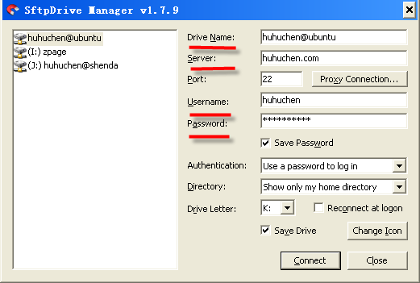
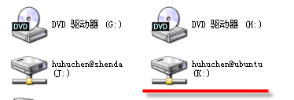

windows常用工具
=====================================================

Snagit
---------------------------------------------------

基本介绍：

强大的截图编辑工具，能够在所截获的图片上添加文字或图示说明，并保存为特定的图片格式。

`点此下载 Snagit <https://bitbucket.org/zuroc/42qu-school/downloads/SnagIt.zip>`_

解压后先运行 Install.reg 即可绿化安装

SftpDriver
---------------------------------------------------

#. 基本介绍

可以把SSH服务器映射成Windows本地硬盘的工具，用户可以方便地在本地进行删除，编辑等操作，就像在本地硬盘上一样方便.

#. 使用说明：

安装好软件后，填写下图中红色部分，依次是驱动名（本地映射的硬盘名将是此名）、服务器域名或ip、服务器登录用户名、服务器登录密码，之后点击connect。

最终在“我的电脑”里将出现下图所示映射硬盘，点击进入，每次上传文件只需要将本地文件复制到该硬盘下相应目录下即可。

`点此下载 SftpDriver <https://bitbucket.org/zuroc/42qu-school/downloads/SftpDrive.rarSftpDrive.rar>`_

