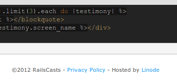

42qu VPS线上推广合作方案
==============================

以下甲方为42qu，乙方为合作网站

甲方希望乙方能够提供（并不限于）以下的合作形式
------------------------------------------------------------

网页显示vps赞助商链接
^^^^^^^^^^^^^^^^^^^^^^^^^^^^^^

乙方在其页面某处（通常为文章底部、侧栏和页面底部），显示甲方的图片广告或链接。

.. image:: _image/pic-ad.png

您可以使用42qu提供的您个人专用的 **返现链接** 。当达到一定的标准时，可以获取42qu的返现。

如下图，railscasts中显示linode的返现链接。

RSS输出 
^^^^^^^^^^^^^^^^^^^^^^^^^^^^^^

用户能够在乙方的rss订阅中看到甲方的相关介绍和链接。

如下图，dbanotes的rss中显示赞助商douban的广告

.. image:: _image/ad-rss.png

甲方能够提供给乙方的利益
------------------------------------------------------------

vps主机折扣
^^^^^^^^^^^^^^^^^^^^^^^^^^^^^^

如果乙方愿意将网站托管到甲方的vps上，
甲方会根据乙方的网站影响力等因素进行评估，给乙方提供适合的主机折扣，
减少乙方网站运营的托管支出。

现金广告投放
^^^^^^^^^^^^^^^^^^^^^^^^^^^^^^

甲方以现金等形式在甲方网站投放广告。
