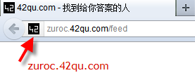

概述
==============================================

:作者: 张沈鹏 `zuroc.42qu.com <http://zuroc.42qu.com>`_  

HTML 
------------------------------

首先推荐开发工具EditPlus , 参见 :ref:`工具 -> Windows -> EditPlus <editplus>`

基本结构
~~~~~~~~~~~~~~~~~~~~~~~~~~~~~~~~~~~~~~~~~~

一个最基本的HTML

.. code-block:: html

    <!DOCTYPE HTML PUBLIC "-//W3C//DTD HTML 4.01 Transitional//EN" "http://www.w3.org/TR/html4/loose.dtd">
    <html>
        <head>
            <meta charset="UTF-8">
        </head>
        <body></body>
    </html>

HTML5的写法更简单 , Google首页就是这样写的 

.. code-block:: html

    <!doctype html>
    <html>
        <head>
            <meta charset="UTF-8">
        </head>
        <body></body>
    </html>

注: 我喜欢简单的写法

head 
~~~~~~~~~~~~~~~~~~~~~~~~~~~~~~~~~~~~~~~~~~

title 标题 
.......................................... 

.. code-block:: html

    <title>42qu.com - 找到给你答案的人</title>

 
网页编码(字符集)
.......................................... 

.. code-block:: html

    <meta charset="UTF-8">

设置当前页面编码为UTF-8

页面描述
.......................................... 

供搜索引擎显示的这个页面的摘要

.. code-block:: html

    <meta name="description" 
          content="无数故事，读完后， 一笑而过。
          下班的地铁，你还是你，我还是我。
          认识一个人， 要多少缘分？
          茫茫人海，擦肩而过多少陌生人。
          42区，这是相遇的地方 ...">

favicon 小图标
..........................................

.. code-block:: html

    <link rel="icon" type="image/x-icon" href="favicon.ico">

其实呢? 可以不写 ... 浏览器有默认值 为 域名/favicon.ico

演示如下 ::

    http://zuroc.42qu.com/favicon.ico

也就是网站根目录下的 favicon.ico

网站根目录下的 favicon.ico 最好可以访问

如果它不存在 , 浏览器每次打开页面都会重新请求这个文件 , 因为 404 请求不会被浏览器缓存

放一个 , 设置为永久缓存, 可以减轻网站服务器的压力

body
~~~~~~~~~~~~~~~~~~~~~~~~~~~~~~~~~~~~~~~~~~

元素类型
...........................................

具体详情 见  `HTML中文手册 <https://bitbucket.org/zuroc/42qu-school/src/02ffbde7b7e4/book/html.chm>`_

使用Firebug可以快速学习现有页面上有哪些元素 , 参见 :ref:`Firebug 查找 / 编辑 元素  <firebug_insert_elem>` 

CSS
------------------------------

Reset Css
~~~~~~~~~~~~~~~~~~~~~~~~~~~~~~~~~~~~~~~~~~

每每有新项目，第一步就是应当使用一个reset.css来重置样式。

#. `Reset CSS研究（八卦篇） <http://ued.taobao.com/blog/2009/03/31/reset_css_a/>`_

#. `KISSY CSS Reset <https://raw.github.com/kissyteam/kissy/master/src/css/src/reset.css>`_
 

大布局
~~~~~~~~~~~~~~~~~~~~~~~~~~~~~~~~~~~~~~~~~~

div 的 布局
...........................................

#. 居中 margin:auto 

#. 左浮动 float:left

#. 右浮动 float:right 

栅格布局
...........................................

#. `960 Grid System <http://960.gs/>`_

#. `Simple grid system <http://www.gridsystemgenerator.com/gs04.php?GridWidth=940&GridColumns=6&GridMarginLeft=20>`_

几栏布局
...........................................

#. Grids Layout for Taobao 
    
    #. `演示页面 <http://kissy.googlecode.com/svn/trunk/src/cssgrids/grids-taobao.html>`_ 
    #. `生成器 <http://kissy.googlecode.com/svn/trunk/src/cssgrids/css-generator.html>`_
    #. `同一个html结构的40种不同布局 <http://blog.html.it/layoutgala/>`_ 

布局框架
...........................................

#. `Twitter 开源的WEB前端框架 Bootstrap <http://www.infoq.com/cn/news/2012/02/bootstrap-2.0.1-released>`_ 

#. `27 款经典的CSS 框架 <http://www.iteye.com/news/20054>`_

小样式
~~~~~~~~~~~~~~~~~~~~~~~~~~~~~~~~~~~~~~~~~~

盒模型
...........................................

#. `css盒模型 网页演示 <http://www.brainjar.com/css/positioning/default.asp>`_
#. `css盒模型 Flash 演示 <http://redmelon.net/tstme/box_model/>`_
#. :ref:`Firebug 查看对象的 css 盒模型 <firebug_box>`

小工具
...........................................

#. :ref:`ColorMania : 屏幕取色 <color_mania>`
#. :ref:`iconfinder 图标搜索引擎 <iconfinder>`
#. :ref:`IEtester 测试各个版本的IE浏览器 <ietester>`
#. :ref:`Web developer : 标尺超级好用 <https://addons.mozilla.org/firefox/60/>`_
#. :ref:`Scrapbook : 山寨别人页面的神器 <scrapbook>`

CSS3
...........................................

系统学习

    `CSS3 系列教程 <http://www.blueidea.com/tech/web/2009/6460.asp>`_ , 内容提要

    #. 圆角
    #. 阴影
    #. 多背景图
    #. 渐变色 `渐变色生成器 <http://gradients.glrzad.com/>`_

实际运用
    
    CSS3渐变按钮 
        
        #. `演示 <http://static.csspod.com/demos/2010/css-buttons.html>`_ 
        #. `教程 <http://csspod.com/archives/css3-gradient-buttons>`_

实例学习 - 仿造 点名时间 写页面
...........................................

#. `页面原型 <http://42qu.github.com/book/file/css_js_realfex/demo>`_ 
#. `一步一步仿写 <http://42qu.github.com/book/file/css_js_realfex/>`_

如何自学 ?
###########################################

#. 首先 `点此打包下载 源代码 <https://github.com/42qu/book/zipball/master>`_

#. 布局学习的目录是 /book/file/css_js_realfex/layout  

#. 样式学习的目录是 /book/file/css_js_realfex/style

#. `点此下载 Beyond Compare 3 <http://code.google.com/p/42qu-school/downloads/detail?name=bcompare-zh.zip&can=2&q=>`_ , 对比每一步文件的差异学习 
    .. image:: _image/bycompare.png

#. 自己新开一个文件 , 对照页面尝试编写

#. 可以使用 Firebug 查看每一步的细节样式

Javascript
------------------------------

Jquery
~~~~~~~~~~~~~~~~~~~~~~~~~~~~~~~~~~~~~~~~~~~~~~~~~~~~~~~~~~~~~~~~~~~~
#. `当年张沈鹏写给美空的Jquery讲义 <http://42qu.github.com/book/file/jquery/>`_
#. `Jquery API 中文手册 , 很古董的版本 <http://42qu.github.com/book/file/jquery_moko/jquery_api>`_

实例学习 - 仿造 点点网 写注册页面
~~~~~~~~~~~~~~~~~~~~~~~~~~~~~~~~~~~~~~~~~~~~~~~~~~~~~~~~~~~~~~~~~~~~

#. `点点网 注册页面的原型 <http://diandian.com>`_ 
#. `一步一步仿写Javascript <http://42qu.github.com/book/file/css_js_realfex/>`_

Firebug
~~~~~~~~~~~~~~~~~~~~~~~~~~~~~~~~~~~~~~~~~~~~~~~~~~~~~~~~~~~~~~~~~~~~

`用 Firebug 动态调试和优化应用程序 <http://www.ibm.com/developerworks/cn/web/wa-aj-firebug/>`_

CDN
~~~~~~~~~~~~~~~~~~~~~~~~~~~~~~~~~~~~~~~~~~~~~~~~~~~~~~~~~~~~~~~~~~~

新浪 公共资源 

    http://sae.sina.com.cn/?m=devcenter&catId=147

    公共资源包含Jquery, Mootools, Prototype,YUI 等通用JS/CSS Framework；您可以通过地址直接引用。

    公共资源前端采用CDN技术，节点分布在全国各地；用户可以就近取得资源内容, 提升您的应用速度。

    赶快使用公共资源来给您的应用加速吧！

