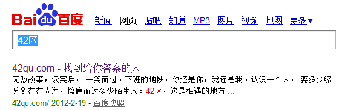

开始旅程 
==============================================

本章作者 : 张沈鹏 `zuroc.42qu.com <http://zuroc.42qu.com>`_ 

准备工作
------------------------------

Editplus - Windows下的编写工具
~~~~~~~~~~~~~~~~~~~~~~~~~~~~~~~~~~~~~~~~~~~~~~~~~
#. 下载安装 ( 我喜欢用360软件管家 ) 

#. 设置新建文件的默认编码为UTF-8 :: 

        Document -> Parmannet Setting -> File 

#. 设置默认显示HTML工具栏 ::
        
    Document -> Parmannet Setting -> File
             -> Setting & syntax -> Show HTML toolbar

#. 创建新的HTML文件 ::
    
    快捷键 Ctrl+Shift+N

#. 快捷键 Ctrl + B 可以 在 浏览器模式 和 编辑模式中切换

HTML 
------------------------------

基本结构
~~~~~~~~~~~~~~~~~~~~~~~~~~~~~~~~~~~~~~~~~~

一个最基本的HTML ::

    <!DOCTYPE HTML PUBLIC "-//W3C//DTD HTML 4.01 Transitional//EN" "http://www.w3.org/TR/html4/loose.dtd">
    <html>
        <head>
            <meta charset="UTF-8">
        </head>
        <body></body>
    </html>

更简单的写法 , 非标准  , Google首页是这样写的 ::

    <!doctype html>
    <html>
        <head>
            <meta charset="UTF-8">
        </head>
        <body></body>
    </html>

注: 我喜欢简单的写法

head 
~~~~~~~~~~~~~~~~~~~~~~~~~~~~~~~~~~~~~~~~~~

title 标题 
.......................................... 

::

    <title>42qu.com - 找到给你答案的人</title>

 
网页编码(字符集)
.......................................... 

::

    <meta charset="UTF-8">

设置当前页面编码为UTF-8

页面描述
.......................................... 

供搜索引擎显示的这个页面的摘要::

    <meta name="description" content="无数故事，读完后， 一笑而过。
          下班的地铁，你还是你，我还是我。
          认识一个人， 要多少缘分？
          茫茫人海，擦肩而过多少陌生人。
          42区，这是相遇的地方 ...">

favicon 小图标
..........................................

::

    <link rel="icon" type="image/x-icon" href="favicon.ico">

其实呢? 可以不写 ... 浏览器有默认值 为 域名/favicon.ico

演示如下 ::

    http://zuroc.42qu.com/favicon.ico

也就是网站根目录下的 favicon.ico

网站根目录下的 favicon.ico 最好可以访问

如果它不存在 , 浏览器每次打开页面都会重新请求这个文件 , 因为 404 请求不会被浏览器缓存

放一个 , 设置为永久缓存, 可以减轻网站服务器的压力

body
~~~~~~~~~~~~~~~~~~~~~~~~~~~~~~~~~~~~~~~~~~

元素类型
...........................................

具体详情 见  `HTML中文手册 <https://bitbucket.org/zuroc/42qu-school/src/02ffbde7b7e4/book/html.chm>`_

