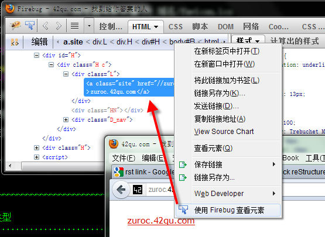
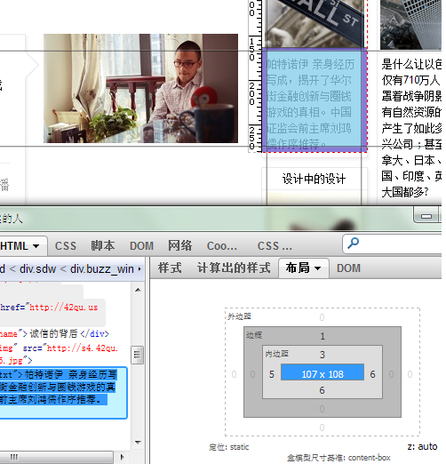

FireBug
============================================

审查元素 
...........................................

使用Firebug可以查看学习现有页面上有哪些元素

点击 **编辑** , 可以直接修改现有页面上的内容 ( 比如 : 把新浪微博的粉丝数修改为9999999 哈哈 )

右侧, 样式 , 可以直接编辑css的属性

查看对象的盒模型
...........................................

